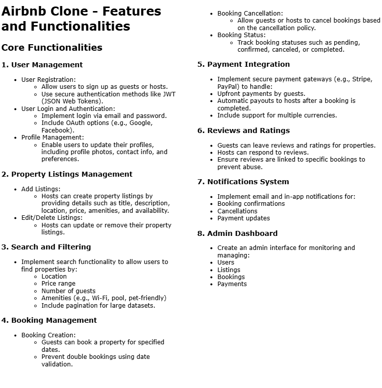

# Airbnb Clone - Features and Functionalities

This project is an **Airbnb Clone** that replicates the core functionalities of a property rental platform.  
The diagram below outlines the main features of the system, including user management, property listings, bookings, payments, reviews, and admin tools.

## Core Features

- **User Management**:  
  Users can register as guests or hosts, log in securely (JWT, OAuth), and manage their profiles.

- **Property Listings**:  
  Hosts can add, edit, and delete property listings with details like location, price, and amenities.

- **Search and Filtering**:  
  Guests can search for properties by location, price range, number of guests, and amenities (Wi-Fi, pool, pet-friendly, etc.).

- **Booking Management**:  
  Guests can book properties for specific dates, while the system prevents double bookings and tracks booking statuses (pending, confirmed, canceled).

- **Payment Integration**:  
  Secure payment gateways (e.g., Stripe, PayPal) handle guest payments and host payouts, with multi-currency support.

- **Reviews and Ratings**:  
  Guests can leave reviews and ratings for properties, and hosts can respond.

- **Notifications System**:  
  Email and in-app notifications for booking confirmations, cancellations, and payment updates.

- **Admin Dashboard**:  
  A management interface for admins to monitor and manage users, listings, bookings, and payments.

---
